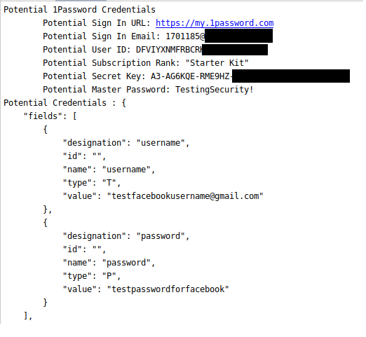

# 1Password Dump Analyzer
Used to extract secret information from Mini Dump files of 1Password7

### Outputs
1Password 
- Login URL
- Email 
- User ID
- Master Password
- Secret Key

Accounts
- Usernames / Emails
- Passwords
- Form Data
- Related Items

### Example Output

### How to Use
###### Getting Dump Files:
1. Open Task Manager in Administrator
2. Right Click 1Password Process
3. Create Dump File
4. Run Script with Path to Dump File